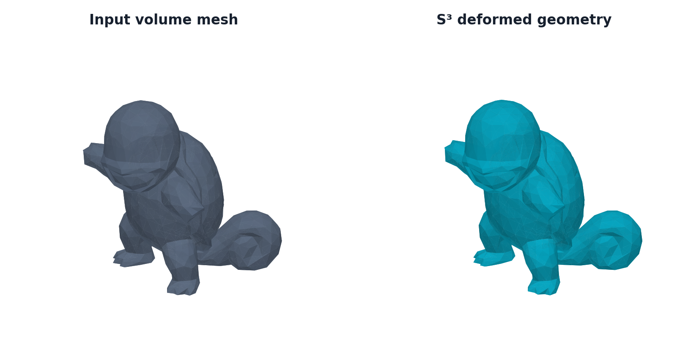
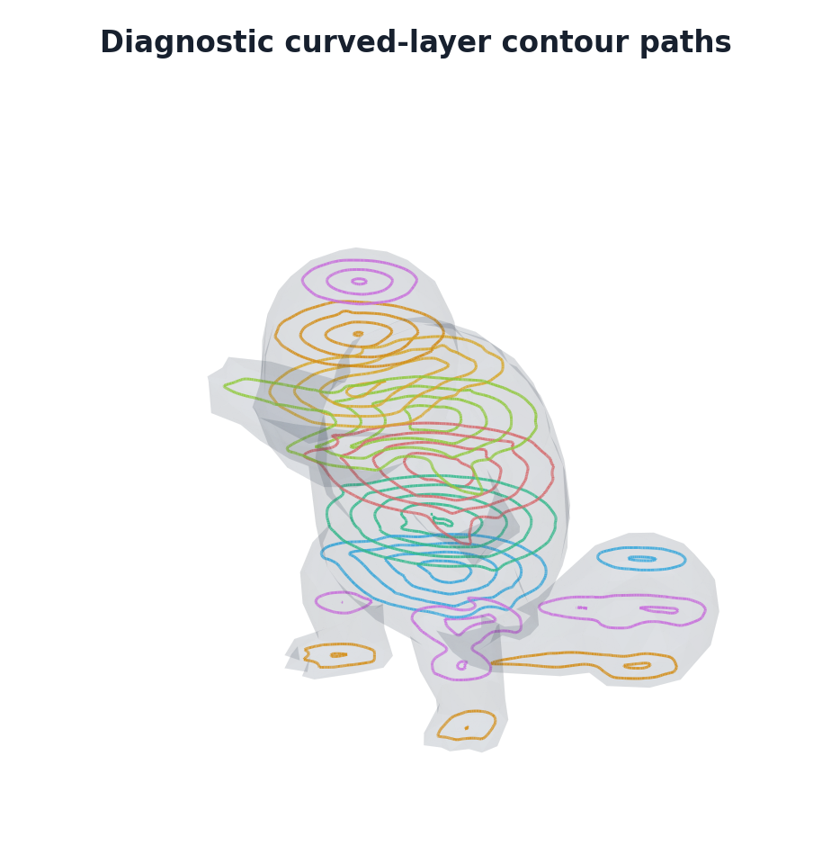
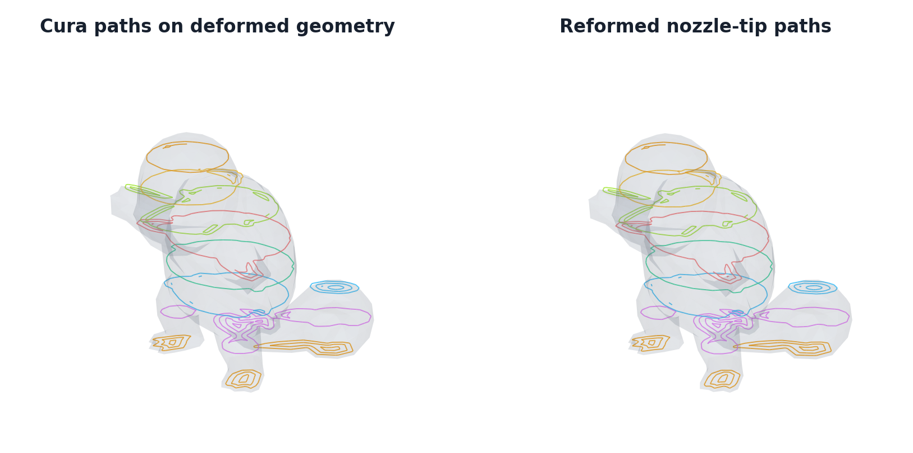

# S³ Slicer

An experimental Python implementation of the deformation and curved-layer ideas
in [*S³-Slicer: A General Slicing Framework for Multi-Axis 3D Printing*](https://doi.org/10.1145/3550454.3555516)
by Zhang and colleagues. It computes a deformation of a tetrahedral model,
transfers deformed height back to the original shape, and exposes curved layers
and contour toolpaths for inspection. For printer G-code, it also has a separate
Cura → S4/S5 reformation path for a Core R Theta style machine.

**Research status:** this is a work in progress. Toolpath coverage, collision
clearance, machine limits, and the paper's full experimental results have not
been validated. See [implementation status](PORT_STATUS.md) before interpreting
an export as a printable result.

## Squirtle walkthrough

These are renders from a test using the included
[Squirtle STL](research/s5/input_models/Squirtle.stl). The surface was simplified
from 12,000 to 1,440 triangles, tetrahedralized to 15,230 cells, scaled to half
size, centered, and dropped to the bed. The
[figure script](docs/figures/render_squirtle.py) records the exact settings.



*Input volume mesh and the S³ deformation. The solver stopped after two outer
iterations by relative stagnation; its worst remaining angle violation was
59.9°. This is a diagnostic result, not a support-free success.*



*Nine diagnostic curved layers yielded 49 contour strokes. These research
paths show the scalar isosurfaces; they are not the paths used for Cura G-code.*



*Selected Cura deposition layers on the deformed mesh (left) and the
reconstructed nozzle-tip paths from reformed S4/S5 machine G-code (right).
The Cura run produced 32 layers. The image does not establish printability.*

## Quick start

Run these commands from the repository root. Python 3.12 is specified in
[`.python-version`](.python-version). The command-line pipeline accepts a
tetrahedral `.tet` mesh; the workbench can also tetrahedralize an STL/OBJ/PLY/OFF
surface such as Squirtle.

```bash
python3 -m venv .venv-s3
.venv-s3/bin/python -m pip install -r requirements.txt

.venv-s3/bin/python -m s3 tests/fixtures/cantilever.tet \
    -o output/s3_cantilever --layers 12
```

## Visual workbench

```bash
.venv-s3/bin/python -m pip install -r requirements-ui.txt
.venv-s3/bin/python -m streamlit run streamlit_app.py
```

1. Choose a `.tet` volume mesh or upload an STL/OBJ/PLY/OFF surface. Uploaded
   surfaces are tetrahedralized. Automatic repair tries TetGen, TetGen after
   surface repair, then FloatTetWild. The fallback needs
   `requirements-repair.txt`, which `requirements-ui.txt` includes.
2. Use **Scale, rotate and place** to orient the model, set its size, and put the
   intended contact surface on the bed. The live preview shows the placed model.
   **Fix build-plate contact surface** is enabled by default. The workbench
   caches the volume mesh while placement controls change.
3. Click **Run paper pipeline**. Inspect **Geometry** with the deformation
   slider and check **Diagnostics** for convergence and build-plate results.
4. Optionally open **Cura slicing** to adjust print settings and click
   **Slice with Cura**. This is a separate path from the research contours.
5. Use **Download** to export deformation arrays, `deformed.tet`, `report.json`,
   and any Cura outputs. The placed input volume mesh can be downloaded before
   running the pipeline.

Research layer and toolpath generation remains available through the CLI:

```bash
.venv-s3/bin/python -m s3 tests/fixtures/cantilever.tet \
    -o output/s3_visual --layers 12 --toolpaths --path-spacing .8 --preview-html
```

Use `--layer-mode adaptive --min-thickness .16 --max-thickness .4` for adaptive
layers instead of a fixed count. `--first-layer-height .2` sets the physical
first-layer height cap for either mode. Use `--path-mode hybrid --objectives fields.npz`
for stress-directed interiors. `--waypoint-distance` sets the maximum segment
length; triangle crossings are retained to keep chords on the curved surface.
HTML export requires the UI dependencies; numerical path generation does not.

The distance field uses surface FEM heat diffusion and a Poisson reconstruction.
Layers are refined in their existing facets to resolve the requested path spacing.
This is a paper-guided implementation, not a bit-for-bit port of the upstream
remeshing/path-linking routines. Equal field increments approximate physical path
spacing; diagnostics expose stress fit error, empty layers, and adaptive spacing
bounds. No claim of complete deposition coverage is made.

The default deformation now preserves the base contact vertices and the rotations
of base-contact tetrahedra. Equal-angle projection choices are guided by distance
from that base; a feasibility backtrack prevents inversion and below-plate material.
Elevated local minima are recorded as diagnostics and do not stop the run.
These are explicit build-boundary additions to the paper equations. Set
`fix_build_plate: false` in a JSON config for the earlier
unconstrained numerical baseline. That baseline can mostly rotate a part and is
not a valid build sequence from the original foot. Saved runs need to be rerun
after changing this setting. When no flat contact face exists, the lowest
boundary triangle anchors the fixed-base solve. A wider `base_band` pins more
of the lowest surface.

## Numerical pipeline

The paper solver assembles COO matrices into CSR and uses CSC sparse LU for
pinned normal-equation solves. Eq. 8 reuses its matrix and factorization while
weights and pinned cells are unchanged, rebuilding for concavity or final SQ-C
weight changes. Projection skips candidate enumeration for already-feasible
directions while retaining preferred-direction boundary ties, and local rotation
updates are batched. Eq. 12's `scale_solver: "auto"` uses column-scaled conjugate
gradients on the pinned normal equations for at least 10,000 free unknowns, and
direct LU for smaller systems. CG avoids LU fill-in, starts from the previous
deformation/scales, and reports iteration counts and relative normal residuals.
It still assembles a sparse normal matrix. The UI's **Eq. 12 solver** selector or
JSON `scale_solver: "iterative"` / `"direct"` overrides automatic selection.

The iterative defaults are `scale_tolerance: 1e-9` and
`scale_max_iterations: 5000`. The final scaled normal residual is explicitly
checked; nonconvergence fails the run without silently switching to LU. Residual
tolerance is not a geometric-error bound for ill-conditioned meshes. Use direct
LU for comparison when evaluating a new model. A running solve must finish or be
stopped before restarting with changed settings.

Official `.tet` datasets are Y-up; request the coordinate conversion explicitly:

```bash
OPENBLAS_NUM_THREADS=1 .venv-s3/bin/python -m s3 \
    ../S3_DeformFDM/DataSet/TET_MODEL/ring.tet --up-axis y \
    -o output/s3_ring --layers 40
```

Output directories must be empty. Outputs include:

- `result.npz`: original/deformed vertices, tetrahedra, rotations, scales and scalar field.
- `deformed.tet`: deformed geometry for inspection.
- `report.json`: input hash, parameters, versions, per-iteration metrics and stopping reason.
- `layers/*.obj`: optional fixed-count isosurfaces in the original shape.
- `toolpaths/*.obj` and `toolpaths/*.json`: optional deposition strokes, with
  point positions and normals in the JSON files.
- `visualization.json`: layer-spacing and toolpath diagnostics.
- `preview.html`: optional self-contained interactive deformation/path viewer.

The paper mode uses raw deformed Z as scalar values. The first layer is bounded by its physical bed-height limit. Layer count does
not imply bounded spacing of subsequent layers, valid toolpaths, or reachable
machine poses.

Configuration overrides use `--config config.json`; fields are defined in
`pipeline.PaperConfig`. For example:

```json
{
  "weight_sf": 0.7,
  "weight_sr": 0.3,
  "weight_sq": 0.0,
  "alpha": 30.0,
  "beta": 10.0,
  "rigidity": 1.0,
  "scale_compatibility": 6.0,
  "inner_iterations": 7,
  "max_outer_iterations": 20
}
```

SR needs `--objectives fields.npz` with `stress` (tet count × 3 principal
directions) and `stress_mask` (tet count booleans selecting critical cells).
Optional `sf_faces` and `sq_faces` are arrays of global face indices in
`TetMesh.faces`. Vectors use the input coordinate frame; the CLI transforms
stress vectors with `--up-axis`. The Python API accepts the same data:

```python
from s3 import read_tet, PaperConfig, run_paper
mesh = read_tet("model.tet")  # Z-up for the paper API
result = run_paper(mesh, PaperConfig(), callback=print)
```

For a source-behavior comparison (not the paper model):

```bash
.venv-s3/bin/python -m s3 ../S3_DeformFDM/DataSet/TET_MODEL/ring.tet \
    --implementation cpp-reference --up-axis y -o output/s3_cpp_port

python3 reference/build_reference.py ../S3_DeformFDM /tmp/s3-reference-build
/tmp/s3-reference-build/s3-reference model_y_up.tet /tmp/native_result
.venv-s3/bin/python -m s3.reference.compare_reference \
    /tmp/s3-reference-build/s3-reference
```

The reference builder requires `g++` and the upstream checkout's vendored Eigen.
It writes only into its build directory and keeps the upstream files intact.

## Cura slicing and S4/S5 reformation

G-code export now uses the S4/S5 deform → Cura → reform workflow. Cura owns walls,
infill, top/bottom layers, travels, retractions, extrusion and source feed rates.
The custom research contour paths are not used to produce G-code.

In the workbench:

1. Set placement and run **Run paper pipeline**.
2. Open **Cura slicing**. Set **Layer height**, **Line width**, first-layer height,
   infill density, wall count, and optional physical bed brim width/gap. Advanced controls select the existing Cura JSON
   profile, engine/definitions, filament diameter, temperatures and nozzle offset.
3. Click **Slice with Cura**. Download **<model-name>.gcode** directly from this tab,
   the top of the sidebar, or **Download**. Changing Cura settings requires reslicing.
4. Optionally enable **Show Cura G-code motion preview**. **Download** also offers
   the original Cura G-code and a ZIP containing both G-code files, deformed STL,
   effective settings/reformation report, and engine log.

The default profile is the repository's existing `config/core.def.json`.
Settings may be loaded from its `settings.global.all` format or a flat JSON map.
The visible Cura controls override the corresponding profile values. Cura's
coordinate frame and relative-extrusion settings are set for the inverse map.
The engine-matched definitions in `/usr/share/cura/resources/definitions` take
precedence over the bundled fallback definitions, as in S5.

```bash
# CuraEngine and its matching definitions must be installed on the host.
# Debian/Ubuntu: sudo apt install cura-engine cura
.venv-s3/bin/python -m pip install -r requirements-cura.txt
.venv-s3/bin/python -m s3 model.tet -o output/s3_cura --gcode \
    --layer-height .2 --line-width .4 --infill-density 20 --brim-width 6
```

`--gcode` invokes Cura without implying `--toolpaths`. `--toolpaths` remains an
independent research export. `--cura` selects the executable and `--cura-profile`
selects the settings JSON. `--gcode-config` accepts overrides for `CuraConfig`:

```json
{"layer_height": 0.2, "first_layer_height": 0.2, "line_width": 0.4,
 "filament_diameter": 1.75, "print_speed": 30, "infill_density": 20,
 "wall_count": 2, "segment_length": 0.6, "nozzle_offset": 41.5,
 "brim_width": 6, "brim_gap": 0}
```

`--start-gcode` and `--end-gcode` provide Cura's startup/shutdown blocks. Their
motion is reformed along with the rest of the file. Defaults home the printer
and turn heaters off at the end; Cura emits temperature and fan commands.

The optional brim is generated after reformation from first-layer outer-wall
paths, at the physical first-layer height with a vertical nozzle. This keeps it
flat on the bed even when the original deformation would lift Cura's own brim.
When enabled, Cura adhesion is set to `none` to avoid printing two brims.
Install `requirements-cura.txt` for the geometry dependency.

```python
from s3.cura import CuraConfig, slice_with_cura
text, report = slice_with_cura(result, "output/s3_cura", CuraConfig())
```

The adapter exports the deformed tetrahedral boundary to STL, centered in XY
and grounded for Cura. It retains that transform when mapping every sampled
G-code position back to the original tetrahedron using signed barycentric
coordinates. Point containment and closest-cell queries use PyVista/VTK, as in
S4/S5. Exterior depositing points and exterior travel endpoints use the closest
cell's affine extension. Intermediate travel samples outside the mesh are
replaced by S5-style bridges at the highest printed height (or higher when an
endpoint requires it). The report counts exterior samples and travel bridges.

S4's radial-plane SVD recovery supplies vertex tilt angles. The S5 X/Z/B/C
mapping applies the nozzle offset and unwraps C. Tilt uses S5's 0.2 smoothing
factor and at most 1° per emitted step; bridge endpoint tilts are clamped to ±45°.
Retraction adds a compensated 1 mm hop, removed before unretraction. Partial and
variable-length retractions are tracked. Cura's own hop is disabled to prevent
stacking. `CuraConfig.z_hop` controls hop height (zero disables it).
Source deposition duration is retained using inverse-time feed, and Cura's
extrusion is distributed across segments. Travel duration is extended as needed
to bound linear axes at `travel_speed` (60 mm/s) and rotary axes at `rotary_speed`
(30°/s); these settings are also exposed in the workbench. This does not certify
collision clearance or acceleration limits.
On the first Cura layer, extrusion follows the mapped path length and the actual
tool-tip height above the bed. This keeps Cura's line width and flow choices
while avoiding an extra reduction from lateral tetrahedron deformation. Later
depositing layers receive S4's original/deformed tetrahedron volume ratio,
capped at the existing S5 default multiplier of 10. E-only retractions and
unretractions are retained without volume correction. Absolute/relative XYZ/E
and G92 resets are normalized; temperature, fan, role and layer annotations are
retained. There is no machine-limit export gate. This is an S4/S5 machine-specific
reformation, not exact reproduction of arbitrary S3 nozzle directions.

Layer height is measured in **deformed space**, so physical spacing after
reformation can vary. The first Cura height is reduced when needed to keep the
mapped first surface at or below the requested physical first-layer height.
The actual layer count comes from Cura, not the research diagnostic count.

The previous `s3.gcode` research-stroke writer remains available as a legacy API,
but neither the workbench nor `--gcode` uses it. Research layers and toolpaths
remain available through the CLI/API; they are not workbench tabs.

## Credits and provenance

- **S³ research:** Tianyu Zhang, Guoxin Fang, Yuming Huang, Neelotpal Dutta,
  Sylvain Lefebvre, Zekai Murat Kilic, and Charlie C. L. Wang,
  [*S³-Slicer: A General Slicing Framework for Multi-Axis 3D Printing*](https://doi.org/10.1145/3550454.3555516),
  ACM Transactions on Graphics 41(6), article 277 (2022). See the
  [authors' project and source](https://github.com/zhangty019/S3_DeformFDM)
  and its [BSD-3-Clause license](LICENSE.upstream). This Python implementation
  follows the paper in validated stages; it is not an exact port of the C++ code.
- **S4 and Core R Theta:** [Joshua Bird's S4 Slicer](https://github.com/jyjblrd/S4_Slicer)
  supplied the reference methods behind the S4/S5 G-code reformation adapter.
  The output targets the kinematics of Bird's
  [Core R Theta 4-axis printer](https://github.com/jyjblrd/Core-R-Theta-4-Axis-Printer).
  The archived [S4 reference](research/s4/s4_reference.py) and
  [S5 research implementation](research/s5/README.md) are kept under `research/`.
  The S4-derived code is GPL-3.0; see the repository [license](LICENSE).
