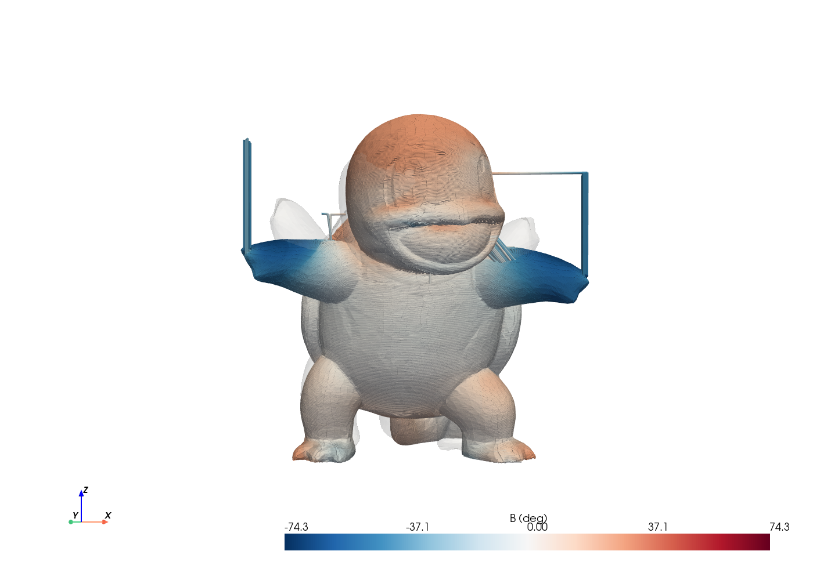
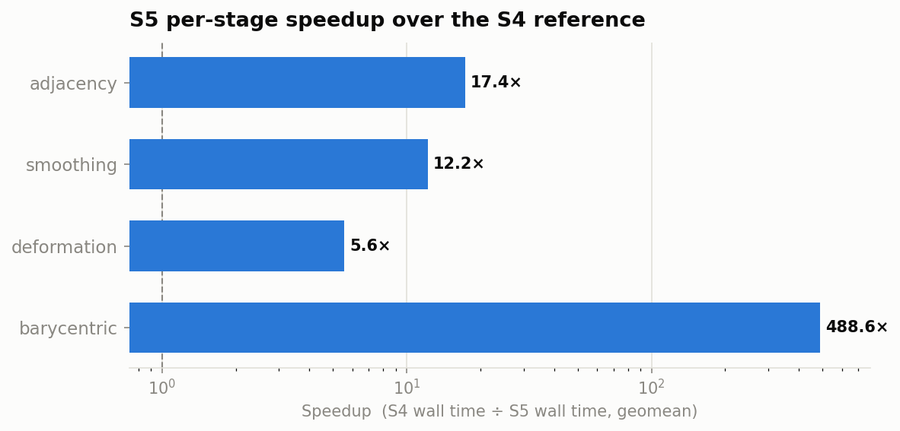

# S5_Slicer

**Support-free 5-axis nonplanar slicing.** S5_Slicer takes an ordinary triangle
mesh and produces nonplanar, rotary 5-axis G-code that tilts the nozzle to print
overhangs *directly* — no support material. It does this by computing a smooth
per-region rotation field that "unfolds" overhangs to a printable angle,
deforming the mesh so those regions become flat, slicing the deformed mesh with
**CuraEngine**, and then re-deforming the toolpaths back onto the original shape
with the nozzle tilt baked in.



*Toolpaths for a model, colored by nozzle tilt (B axis, ±74°). The arms —
steep overhangs on a normal printer — are laid down tilted, without support.*

---

## How it works

The pipeline (`slice()` in `S5.py`) runs these stages:

1. **Tetrahedralize** the input surface into a solid volume mesh, with a robust
   fallback ladder (`tetgen` as-is → `tetgen` after mesh repair → FloatTetWild),
   so self-intersecting or non-watertight CAD meshes still slice.
2. **Overhang analysis** — classify each surface region by how far its normal
   leans past vertical.
3. **Rotation field** — solve for a smooth per-cell rotation that brings every
   overhang within the printable angle (a Laplacian-smoothed field over the tet
   dual graph).
4. **Deformation** — apply that rotation field as a volumetric deformation (a
   direct sparse solve), flattening the overhangs.
5. **Planar slice** — hand the *deformed* mesh to CuraEngine for a normal planar
   slice.
6. **Reprojection** — map every toolpath point back onto the original geometry
   and recover the per-point nozzle orientation, producing 5-axis G-code.

The math follows the S5 method; see [`S5.pdf`](S5.pdf) for the derivation and
[`OPTIMIZE.md`](OPTIMIZE.md) for the engineering log of correctness fixes.

---

## Requirements

- **Python 3.12** (see `.python-version`)
- **CuraEngine 5.0.0** on `PATH` (Debian/Ubuntu: `apt install cura-engine`).
  S5 shells out to it for the planar slice.
- CuraEngine's bundled printer/extruder definitions. On Debian these ship with
  the `cura` package under `/usr/share/cura/resources/definitions/`; S5 uses
  them by default (see [Cura setup](#cura-setup)).
- The Python packages in `requirements.txt` — the notable ones are `pyvista`,
  `tetgen`, `wildmeshing` (FloatTetWild), `libigl`, `potpourri3d`, `open3d`,
  `trimesh`, `pymeshfix`, `scipy`, and `pygcode`.

## Installation

```bash
git clone <this-repo> && cd S5_Slicer
python3.12 -m venv .venv
source .venv/bin/activate
pip install -r requirements.txt

# CuraEngine (Debian/Ubuntu)
sudo apt install cura-engine cura
```

Verify the engine is found:

```bash
CuraEngine --version        # -> Cura_SteamEngine version 5.0.0
```

## Quickstart

```bash
python S5.py "input_models/dino.stl" -o output
```

This writes the final 5-axis G-code to `output/dino_<timestamp>.gcode`. Add
`--verbose` to see each stage's timing and diagnostics.

A more tuned run:

```bash
python S5.py mymodel.stl \
    -o output \
    --reorient 90,0,0 \        # stand the part up before slicing
    --scale 1.5 \
    --max-overhang 35 \        # allow steeper overhangs before correcting
    --nozzle-offset 41.5 \     # your machine's B-pivot-to-tip distance
    --gcode-dialect rtheta \
    --verbose
```

---

## Command-line reference

```
python S5.py MODEL.stl [options]
```

### I/O
| Flag | Default | Description |
|---|---|---|
| `MODEL.stl` (positional) | — | Input surface mesh. STL, OBJ, PLY — anything `trimesh` loads. |
| `-o`, `--output` | `output` | Output **directory** for G-code and intermediates. |
| `-c`, `--config` | `config/core.def.json` | Cura settings, as a Cura GUI settings-export JSON. |
| `-u`, `--cura` | `/usr/bin/CuraEngine` | Path to the CuraEngine binary. |
| `--printer_path` | system `fdmprinter.def.json`, else bundled | CuraEngine printer definition. |
| `--extruder_path` | system `fdmextruder.def.json`, else bundled | CuraEngine extruder definition. |

### Mesh placement
| Flag | Default | Description |
|---|---|---|
| `--reorient X,Y,Z` | none | Intrinsic Euler rotation (degrees) applied first, e.g. `90,0,180`. |
| `--scale FACTOR` | `1.0` | Uniform scale before slicing. |
| `--offset X Y Z` | `0 0 0` | Extra offset (mm) after auto-centering. Auto-centering puts the bounding-box center at (0,0) and the bottom face at Z=0. |

### Rotation field
| Flag | Default | Description |
|---|---|---|
| `--max-overhang DEG` | `30` | Maximum printable overhang from vertical. Faces steeper than 90°+DEG from ẑ are treated as overhangs to correct. |
| `--rotation-multiplier K` | `2.0` | Scales the raw overhang magnitude before smoothing — higher = more aggressive tilt. |
| `--neighbor-loss-weight W` | `30` | Laplacian smoothing weight for the rotation field. Smoothing length scales ~√W, so change it in order-of-magnitude steps. |

### Machine / G-code
| Flag | Default | Description |
|---|---|---|
| `--nozzle-offset MM` | `41.5` | Distance from the B-axis pivot to the nozzle tip. Corrects radial/Z position as the nozzle tilts — **set this to your machine's value.** |
| `--rotation-smoothing ALPHA` | `0.25` | EMA smoothing of the B axis between points (0 = fully smoothed, 1 = none). Must be in (0, 1]. |
| `--gcode-dialect {rtheta,unlayered}` | `rtheta` | Output dialect — see [G-code dialects](#g-code-dialects). |
| `--start-gcode FILE` | built-in | Override start G-code (`unlayered` dialect only). |
| `--end-gcode FILE` | built-in | Override end G-code (`unlayered` dialect only). |

### Misc
| Flag | Description |
|---|---|
| `-v`, `--verbose` | Print per-stage timing and diagnostics. |

---

## Output files

Every run writes to the `--output` directory, with a per-run timestamp in each
name (`<model>_<timestamp>`):

| File | What it is |
|---|---|
| `<model>_<ts>.gcode` | **The final 5-axis nonplanar G-code** — this is what you print. |
| `<model>_<ts>_deformed_tet.stl` | The deformed (overhangs-flattened) mesh handed to Cura. |
| `<model>_<ts>_deformed_tet.gcode` | Cura's planar G-code for the deformed mesh (pre-reprojection). |
| `<model>_<ts>_cura.log` | Full CuraEngine output — inspect this if the slice fails. |
| `deformed_<model>_<ts>.pkl` | Pickled deformed tet grid (internal cache). |

## G-code dialects

- **`rtheta`** (default) — polar **Core-R-Theta** dialect for a machine with a
  rotating build plate (C), radial carriage (X), Z, and a tilting nozzle (B).
  Uses inverse-time feed (`G93`) and relative extrusion.
- **`unlayered`** — Cartesian **XYZ + B/C** dialect (RepRapFirmware-style RTCP):
  `G1 X Y Z B C E`, relative extrusion, `mm/min` feedrates, and `;LAYER_CHANGE` /
  `;TYPE` / `;WIDTH` annotations. Supports custom `--start-gcode` / `--end-gcode`.

---

## Cura setup

S5 drives CuraEngine 5.0.0. Two details matter:

- **Definitions.** The bundled `config/fdmprinter.def.json` / `fdmextruder.def.json`
  are exported from a newer Cura (5.11) and are **incompatible** with the 5.0.0
  engine. S5 therefore defaults to the engine-matched system definitions under
  `/usr/share/cura/resources/definitions/`, falling back to the bundled copies
  only if those are absent. Override with `--printer_path` / `--extruder_path`.
- **Settings.** Print settings (`-c` / `--config`) come from a Cura GUI
  settings-export JSON (`config/core.def.json` by default), applied to the engine
  as `-s key=value` flags.

If CuraEngine fails, S5 now stops with a clear error and points you at the
`<model>_<ts>_cura.log` it captured, instead of crashing downstream.

## Visualization (optional)

`s5_viz.py` can dump a labeled screenshot at each pipeline stage (overhang
analysis, rotation field, deformation, toolpaths, …) into `plots/`. It's off by
default; enable it by setting `VizConfig.enabled = True` near the top of `S5.py`.

## Benchmarking

S5 is the optimized rewrite of an earlier reference implementation (`s4_reference.py`).
`s5_bench.py` instruments the hot stages, and two helper scripts run and report a
full comparison:

```bash
python bench_sweep.py            # run S4-vs-S5 across input_models/
python bench_report.py           # aggregate -> bench_results/REPORT.md + chart
```

The generated **[benchmark report](bench_results/REPORT.md)** covers per-stage
timing, S4→S5 speedup, and correctness across models from 48 to ~293k cells.
Headline: the barycentric reprojection stage is ~**490× faster** than the
reference, and every model in the set slices end-to-end.



---

## Repository layout

| Path | What |
|---|---|
| `S5.py` | The slicer — pipeline + CLI. |
| `s5_viz.py` | Per-stage visualization (opt-in). |
| `s5_bench.py` | Benchmark instrumentation. |
| `s4_reference.py` | Naive reference implementation, for correctness/timing comparison. |
| `bench_sweep.py`, `bench_report.py` | Run and report the benchmark sweep. |
| `input_models/` | Test meshes. |
| `config/` | Cura settings + bundled definitions. |
| `plots/`, `bench_results/` | Visualization and benchmark outputs. |
| `S5.pdf` | The method write-up. |
| `OPTIMIZE.md` | Engineering log of correctness/perf fixes. |

---

## License & credits

S5_Slicer is licensed under the **GNU General Public License v3.0** — see
[`LICENSE`](LICENSE).

It is a derivative of **[S4_Slicer](https://github.com/jyjblrd/S4_Slicer)** by
**Joshua Bird**, which is licensed GPL-3.0. The underlying method and the
reference implementation (`s4_reference.py`) are Joshua Bird's work; S5_Slicer
extends and optimizes them. If you use this project, please also credit S4_Slicer:

> Joshua Bird, *S4 Slicer*. https://github.com/jyjblrd/S4_Slicer (GPL-3.0)
